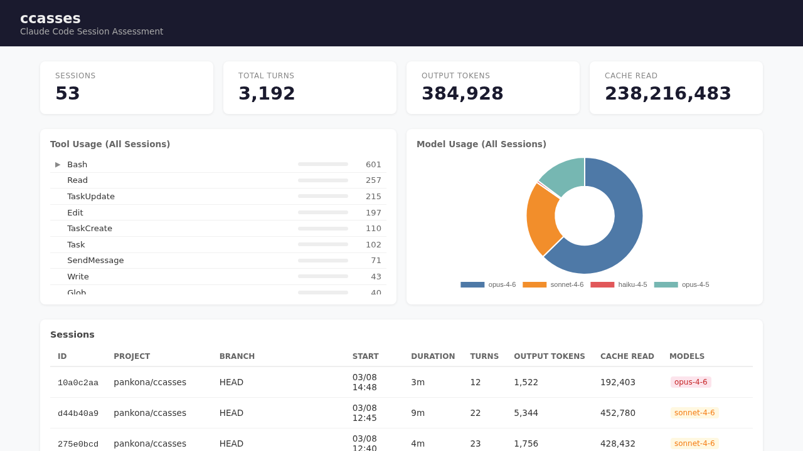

# ccasses

**Claude Code Session Assessment** — Claude Code のセッショントランスクリプトを可視化するツール

## 概要

`~/.claude/projects/` に保存されている Claude Code のセッション JSONL ファイルを解析し、ブラウザで閲覧できる Web UI を提供します。

- 全セッションの一覧・統計表示
- ツール使用状況の内訳
- コンテキストウィンドウの使用率を時系列グラフで可視化
- Compaction / Cache Reset / モデル切り替えの可視化
- SubAgent（Agent ツール）の活動をメインタイムライン上にオーバーレイ表示

## スクリーンショット

### セッション一覧

全セッションのサマリー、ツール使用ランキング（折りたたみ対応）、モデル別使用率を表示します。



## インストール

Go 1.21 以上が必要です。

```bash
go install github.com/pankona/ccasses/cmd/ccasses@latest
```

またはリポジトリをクローンしてビルド:

```bash
git clone https://github.com/pankona/ccasses.git
cd ccasses
go build ./cmd/ccasses/
```

## 使い方

### 1. インストール（未実施の場合）

```bash
go install github.com/pankona/ccasses/cmd/ccasses@latest
```

または手元でビルドする場合:

```bash
git clone https://github.com/pankona/ccasses.git
cd ccasses
go build ./cmd/ccasses/
```

`go install` を使った場合は `$GOPATH/bin`（デフォルト: `~/go/bin`）に `ccasses` バイナリが生成されます。`$PATH` に含まれていない場合は追加してください。

```bash
export PATH="$PATH:$(go env GOPATH)/bin"
```

### 2. Web UI を起動する

```bash
ccasses serve
```

起動後、ブラウザで http://localhost:8080 を開くとセッション一覧が表示されます。

ポートを変更する場合:

```bash
ccasses serve --port 9090
```

Claude Code のセッションデータは `~/.claude/projects/` から自動的に読み込まれます。特別な設定は不要です。

### 3. セッションを閲覧する

- トップページに全セッションの一覧が表示されます
- セッションをクリックすると詳細画面に遷移します
- 詳細画面の「Timeline」グラフでコンテキスト使用率の推移や SubAgent の活動を確認できます
- グラフ上でホイールスクロールでズーム、ドラッグでパンできます

### JSON を標準出力に出力する

```bash
ccasses generate
```

全セッションのサマリーを JSON として標準出力に出力します。他のツールへのパイプや独自集計に利用できます。

```bash
# セッション数を確認する例
ccasses generate | jq 'length'

# 特定プロジェクトのセッションだけ抽出する例
ccasses generate | jq '[.[] | select(.project == "your/project")]'
```

## データソース

Claude Code は `~/.claude/projects/<project-dir>/<session-id>.jsonl` にセッションログを保存しています。ccasses はこれを解析して以下の情報を抽出します:

- モデル名・トークン使用量（input / output / cache read / cache creation）
- ツール使用履歴（Bash, Read, Edit, Write, Glob, Grep, Agent など）
- SubAgent セッション（`<session-id>/subagents/agent-*.jsonl`）

## ライセンス

MIT
